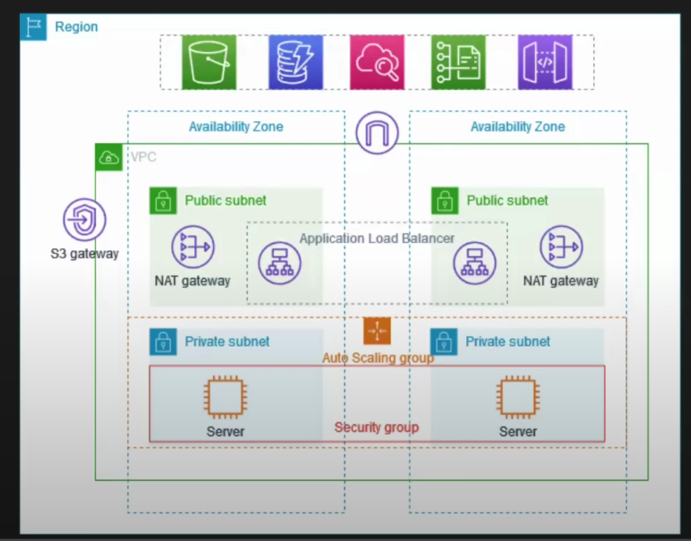

## VPC with public-private subnet in Production

- Two AZ's
- Auto Scaling Groups
- Application Load Balancer
- Public Subnet Conatins a NAT gateway and Load Balancer node
- Servers in Private subnets and receive traffic from Load Balancers
- Servers connect to the internet via the NAT gateway.

Refer : https://docs.aws.amazon.com/vpc/latest/userguide/vpc-example-private-subnets-nat.html